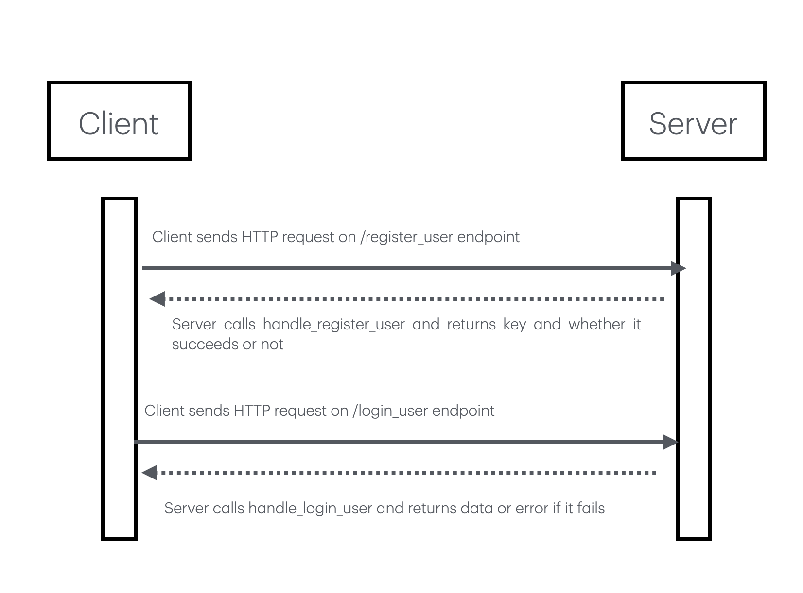

# authentication-service
CS 361 authentication-service - Handles user registration and login for Sprint 2.

## Planned Features
- Register a user
- Log in a user
- Reject invalid login attempts

## Communication Pipe
REST API

## Developers
- Fox Caminiti
- Ilium East
- Alexander Dewey
- Sterling Jones

## description
This microservice manages user account creation and authentication. It exposes a REST API with two primary endpoints (`/register_user` and `/login_user`) that accept and return JSON payloads.

## how to request
To programmatically request data, initiate an HTTP POST request to either the /register_user or /login_user endpoint, passing a JSON payload that contains both a username and a password key. 

## how to recieve
To programmatically receive and process the data, your application must evaluate the HTTP status code returned by the server before parsing the response body. If the operation is successful, the server returns a 200 status code along with a JSON object containing a success message, which you can extract in Python using 
response.json()["key"]

## UML diagram

